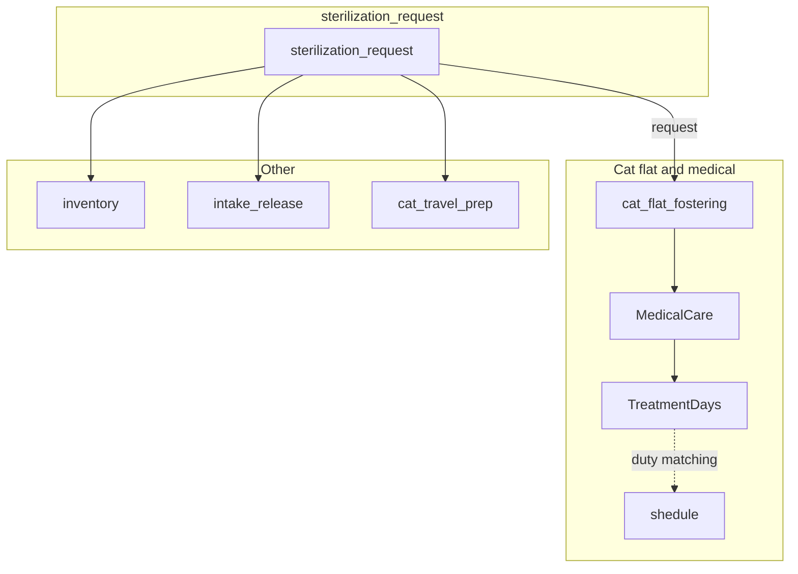
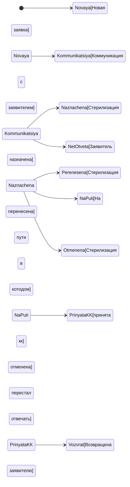
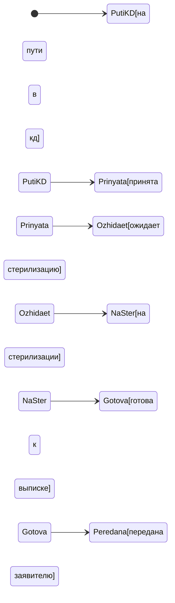

# TNR Telegram Bot — Product Requirements Document (PRD)

**Organization:** TNR programme, Tbilisi  
**Document type:** Pre-build product specification  
**Primary release:** v1 — requestor-facing bot only  
**Architecture:** Hybrid — Airtable is system of record; Telegram bot handles messaging and lightweight interactive state  

**Schema source:** This PRD is aligned to the **`sterilization_main`** Airtable base. The canonical hub table for intake and requestor-facing logic is **`sterilization_request`**. Field names and single-select options follow the live base; confirm **field IDs** via the Airtable API when implementing integrations (names can change).

---

## 1. Problem statement, goals, non-goals, and success metrics

### 1.1 Problem statement

Requestors submit one Airtable form per cat, then rely on ad hoc messages and memory for **what stage they are in**, **what to do next**, and **when and where to arrive** for sterilisation and cat-flat logistics. That creates anxiety, repeated questions to operators, miscommunication about fasting and carriers, and **no-shows or late arrivals** that disrupt transport and clinic scheduling.

Operators already coordinate dates, clinics, and messages manually. The product should **reduce coordination load** and **improve reliability** without replacing operator judgment in v1.

### 1.2 Product goals (v1)

- Give each requestor a **single, authoritative view of status** for their cat(s), aligned with **`sterilization_request`** (and, when relevant, linked **`cat_flat_fostering`** records).
- **Confirm or surface inability to attend** for scheduled sterilisation where the product adds confirmation flows (may require **extension fields** — see §5.4).
- Send **timely, idempotent reminders** keyed off **`steril_date`** and **`status`** changes where configured.
- Provide messaging that respects **pregnancy and urgency**, using **`is_pregnant`** / **`pregnant_notes`**, not separate fictional risk enums unless added to Airtable later.
- Offer a **reliable human handoff** path (operator contact) for anything ambiguous or urgent.

### 1.3 Non-goals (v1)

- Operator or volunteer **dashboards, bulk tools, or scheduling UIs inside Telegram**.
- **Automated medical decisions** (the bot does not diagnose; it reflects Airtable and approved copy).
- **Processing payments** inside Telegram — the base already stores payment-related fields; the bot does not move money or replace finance workflows.
- **Full medical records** or clinic EMR integration.
- **Marketing broadcasts** unrelated to an active request.

### 1.4 Success metrics

| Metric                      | Definition                                                                              | Target direction |
| --------------------------- | --------------------------------------------------------------------------------------- | ---------------- |
| Link rate                   | % of new form submissions with successful Telegram ↔ record association within 24h   | Increase         |
| Pre-day confirmation rate   | % of scheduled cases with explicit attendance confirmation before cutoff (if implemented) | Increase         |
| No-show / late arrival rate | Missed or late arrivals vs planned window (if logged)                                  | Decrease         |
| Operator time saved         | Self-reported minutes per case or weekly survey                                         | Increase         |
| Delivery reliability        | Failed `sendMessage` / webhook errors per 100 notifications                             | Decrease         |
| Support deflection          | Count of “where do I go?” messages to operators per case (baseline vs after)            | Decrease         |

---

## 2. Database overview (`sterilization_main`)

### 2.1 Base scope

The **`sterilization_main`** base holds **13 interconnected tables** covering sterilisation requests, cat-flat fostering, medical care, inventory, volunteer schedule, travel prep, and related data. Multilingual single-select options (Russian / English / Georgian) are used across many fields.

### 2.2 Tables and bot relevance

| Table | Role for requestor bot |
| ----- | ------------------------ |
| **`sterilization_request`** | **Primary.** One row per submitted request; **`telegram`**, **`id`**, **`status`**, **`operator`**, **`created_date`**, logistics and cat fields. |
| **`cat_flat_fostering`** | **Secondary.** Tracks the cat in the cat flat; linked via **`request`** → `sterilization_request`. Use for “in recovery / in flat” messaging when a fostering row exists. |
| **`MedicalCare`**, **`TreatmentDays`** | Mostly **operator / medical**; bot may read later for rich recovery content. |
| **`inventory`** | Equipment loans; **operator-led**; optional future bot surfacing. |
| **`intake_release`**, **`_intake_release`** | Intake/release events and templates; coordinate with ops before automating messages. |
| **`cat_travel_prep`**, **`cat_travel_contacts`** | International travel; **specialised** flows; out of default v1 scope. |
| **`частота использования лекарств`** | Medication usage patterns; **not** requestor-facing by default. |
| **`shedule`**, **`в наличии`**, **`в наличии 2`** | **Synced from other bases — read-only** in this base. The bot must **not** write to these tables. |

### 2.3 Relationship diagram (core)

---

## 3. Personas and scope

### 3.1 Primary persona — Requestor

- Submitted the intake form (one submission per cat in **`sterilization_request`**).
- Uses Telegram; **`language`** on the record may be **`ru`**, **`en`**, or **`ka`** — product copy should respect this when messaging.
- Needs **predictability**, **logistics**, and **what to bring**, not internal priority scores.

### 3.2 Secondary personas (informed by PRD, not v1 bot users)

- **Operator:** Updates **`sterilization_request`** and related tables; assigned via **`operator`** single-select.
- **Transport / clinic volunteer:** Uses Airtable views and schedules (out of scope for bot UI in v1).

---

## 4. Status model (aligned to Airtable)

### 4.1 `sterilization_request.status` (single select)

These are the **authoritative** workflow values on the request row. User-facing Telegram copy should map to these (not to a parallel fictional enum).

| Value (Airtable) | Meaning (summary) |
| ---------------- | ----------------- |
| **Новая заявка** | New request submitted. |
| **Коммуникация с заявителем** | Operator is communicating with the requestor. |
| **Стерилизация назначена** | Sterilisation scheduled — use with **`steril_date`** for timing. |
| **Стерилизация перенесена** | Sterilisation rescheduled. |
| **На пути в котодом** | Cat en route to the cat flat. |
| **Возвращена заявителю** | Cat returned to requestor (requestor-facing completion path). |
| **Стерилизация отменена** | Cancelled. |
| **принята в кк** | Accepted at cat flat (“кк”). |
| **Заявитель перестал отвечать** | No response from requestor. |

Optional **product notes** (for copywriters — not extra Airtable values):

- **Новая заявка** — Acknowledge receipt; set expectations for operator contact.
- **Коммуникация с заявителем** — May need more info; emphasise checking messages.
- **Стерилизация назначена** — Drive reminders from **`steril_date`**; include **`clinic`**, **`district`**, **`address`** / **`geo_location`** as needed for logistics (see §7).
- **На пути в котодом** / **принята в кк** — Coordinate handoff timing; align with fostering row if present.
- **Стерилизация отменена** / **Заявитель перестал отвечать** — Sensitive tone; offer human support.

### 4.2 `cat_flat_fostering.status` (single select)

Used when a **`cat_flat_fostering`** row exists and links to the request (**`request`** field). Prefer this table for **in-flat / recovery** nuance; **`sterilization_request`** still holds top-level request lifecycle.

| Value (Airtable) | Meaning (summary) |
| ---------------- | ----------------- |
| на пути в кд | On the way to cat flat |
| принята в кд | Accepted at cat flat |
| ожидает стерилизацию | Awaiting sterilisation |
| на стерилизации | In sterilisation |
| готова к выписке | Ready for release |
| на сторонней передержке | External foster |
| передана заявителю | Returned to requestor |
| назначен медуход | Medical care assigned |
| укотовлена | Adopted |
| в клинике | At clinic |

**Product rule:** Decide explicitly (see §11) which fostering statuses trigger **requestor-visible** bot messages vs operator-only updates.

### 4.3 Pregnancy and urgency

- Use **`is_pregnant`** (Да / Нет / Нет уверенности — trilingual options in base) and **`pregnant_notes`**.
- Urgent or non-batch clinic routing is an **operator decision** reflected in **`clinic`**, **`status`**, **`notes`**, and related processes — not a separate `scheduled_urgent` status unless the organisation adds one.

### 4.4 State diagrams

**Request lifecycle (simplified)**

**Optional: fostering row (parallel track)**

---

## 5. Airtable data model and bot integration

### 5.1 `sterilization_request` — field groups relevant to the bot

Fields below follow the **`sterilization_main`** schema. **Implementation should use stable field IDs** from the API where possible.

**Identifiers and admin**

| Field | Type | Bot notes |
| ----- | ---- | --------- |
| **`id`** | Autonumber | Public-facing “request #” candidate (current bot lists this). |
| **`created_date`** | Date | Submission / creation date. |
| **`status`** | Single select | §4.1 |
| **`operator`** | Single select | Lida, Olya, Nata, Mariam, Mari, Nikolaeva, Kotovnik, Alena, Mikhail, Yuliya, Vika, Sasha, MariSigma, Liza |
| **`steril_date`** | Date | Scheduled sterilisation date — anchor for reminders. |
| **`sterilized`** | Checkbox | Completed procedure. |
| **`language`** | Single select | **`ru`**, **`en`**, **`ka`**. |
| **`notes`** | Long text | Free-form; avoid duplicating sensitive data in Telegram unnecessarily. |

**Requestor / contact**

| Field | Type | Bot notes |
| ----- | ---- | --------- |
| **`requestor_name`** | Single line text | Display name. |
| **`telegram`** | Single line text | Match to Telegram username (with/without `@`) — **current bot behaviour**. |
| **`phone`**, **`whatsapp`**, **`viber`**, **`email`**, **`instagram`** | Various | Alternate contacts for handoff. |
| **`messengers`** | Multiple select | Preferred channels. |
| **`requestor_contact`** | Long text | Legacy formatted block. |
| **`Contacts`** | Formula | Read-only formatted contacts. |

**Location**

| Field | Type | Bot notes |
| ----- | ---- | --------- |
| **`address`** | Single line text | Logistics. |
| **`geo_location`** | Single line text | Map link. |
| **`district`** | Single select | Tbilisi districts (multilingual options). |

**Cat**

| Field | Type | Bot notes |
| ----- | ---- | --------- |
| **`sex`**, **`cat_type`**, **`wild_or_tame`**, **`health`**, **`health_notes`** | Single select / long text | Context for messaging. |
| **`is_pregnant`**, **`pregnant_notes`** | Single select / long text | Urgency copy. |
| **`is_deflead`**, **`is_vaccinated`**, **`cat_picture`**, **`Примерный вес кошки`** | Various | Mostly informational for v1. |

**Service preferences**

| Field | Type | Bot notes |
| ----- | ---- | --------- |
| **`clinic`** | Single select | Named clinics / “no preference”. |
| **`catch_type`**, **`needs_foster_care`**, **`need_carrier`**, **`return_type`** | Single select / checkbox | Logistics and expectations. |

**Payment and vaccination (read-heavy for bot)**

Payment-related fields (**`payment_choice`**, **`is_paid`**, **`pay_for_*`**, vaccination checkboxes and **`vac_payment_*`**) exist in the base. The bot **does not process payments**; it may **surface read-only status** in later phases if product approves.

### 5.2 Formula / computed fields (read-only)

Examples: **`Contacts`**, **`Нужно вакцинировать?`**, **`payment_calculated`**, **`sex_calculated`**, **`pregnancy_calculated`**, **`vac_payment_calc`**, **`created_year_month`**. The bot may **read** these for display; **writes** go only to editable fields (or extension fields in §5.4).

### 5.3 `cat_flat_fostering` — key fields for cross-table UX

| Field | Type | Bot notes |
| ----- | ---- | --------- |
| **`request`** | Link to `sterilization_request` | Join key. |
| **`status`** | Single select | §4.2 |
| **`in_date`**, **`out_date`** | Date | Stay window. |
| **`room`**, **`notes_kk`** | Multiple select / long text | Context for in-flat messaging. |

Lookups from linked request (contacts, cat details) may exist — use Airtable API metadata to enumerate.

### 5.4 Extensions not in current schema (product / Phase 1b)

These support **token linking**, **confirm/decline**, and **idempotent notifications** as described in earlier product discussions. They are **not** documented as present on `sterilization_request` today — add when the base is extended:

- **`telegram_user_id`** (or equivalent) — stable Telegram user id after link.
- **`link_token`**, **`link_token_expires_at`**, **`linked_at`** — deep-link binding.
- **`attendance_confirmation`**, **`confirmation_received_at`** — structured confirm/decline.
- **`last_notified_status`**, **`last_notified_at`** — notification deduplication.
- **`mute_noncritical`** — respect quiet / education-only mute.
- **`Bot_events`** (separate table) — append-only audit with **`idempotency_key`**.

**Hybrid principle:** chat is not the system of record; structured state lives in Airtable (or **`Bot_events`**) once these exist.

**Scheduling note:** There is **no** separate `Castration_days` table in **`sterilization_main`**. Batch-day logistics are represented by **`steril_date`**, **`clinic`**, **`district`**, **`address`**, **`notes`**, and operator process. A dedicated “castration day” table remains a **future** option if operations standardise it.

---

## 6. Telegram UX — commands, linking, notifications

### 6.1 Account linking flows

**Current behaviour (MVP):** Match **`telegram`** field to the user’s public **Telegram @username** (normalised; with or without `@`). No token yet.

**Planned — tokenized `/start`**

1. On form submission (or in automation), generate **`link_token`** + expiry on the request row (requires §5.4 fields).
2. User opens `https://t.me/<YourBot>?start=<token>`.
3. Bot validates token, stores **`telegram_user_id`**, clears token, confirms **`id`** and request context.

**Fallback:** Operator verifies identity and resets token manually.

### 6.2 Commands and menu (v1 target)

| Command / action | Behaviour |
| ------------------ | --------- |
| `/start` | List requests matching **`telegram`** (current); later tokenised link. |
| `/status` | Summarise matched requests: **`id`**, **`created_date`**, **`status`**, **`operator`**, and optionally fostering-aware copy when linked rows exist. |
| `/help` | Human contact and FAQ. |
| `/language` | Should align with **`language`** field (`ru` / `en` / `ka`) when write-back exists. |

**Inline keyboards (when confirmations exist)**

- Confirm / Cannot attend when **`status`** is **Стерилизация назначена** (or as defined by ops) and attendance fields exist.

### 6.3 Notification matrix (transactional)

Driven by **Airtable changes** (webhooks / polling / automations). All sends should be **idempotent**.

| Trigger | Audience | Timing | Message intent |
| ------- | -------- | ------ | -------------- |
| **`status` → Стерилизация назначена** | Requestor | Immediate | **`steril_date`**, **`clinic`**, location fields; optional confirm buttons if §5.4 exists. |
| **`steril_date`** set/changed | Requestor | Immediate | Update + re-confirm if confirmations exist. |
| Reminder | Requestor | T−24h / T−2h (configurable) vs **`steril_date`** | Logistics, fasting/carrier per **approved** templates. |
| **`status`** → **На пути в котодом** / **принята в кк** | Requestor | Immediate | Handoff / arrival expectations. |
| Linked **`cat_flat_fostering.status`** changes | Requestor | If product enables | Recovery / pickup — only for agreed statuses (§11). |
| **`status`** → **Стерилизация отменена** | Requestor | Immediate | Clear cancellation + support path. |

**Quiet hours (optional):** e.g. 22:00–08:00 Tbilisi; still send same-day critical logistics.

### 6.4 Copy and localization

- Templates keyed by **`language`** (`ru` / `en` / `ka`) and by **`status`** / event type.
- Medical / pre-op lines require **vet-approved** wording.

---

## 7. Scheduling, logistics, and priority

### 7.1 Authority

- **Operators** set **`steril_date`**, **`clinic`**, **`status`**, and narrative in **`notes`**.
- The bot does not auto-assign slots from “priority” in v1.

### 7.2 Logistics fields

Use **`steril_date`**, **`district`**, **`address`**, **`geo_location`**, **`clinic`**, **`catch_type`**, **`need_carrier`**, **`return_type`**, and operator **`notes`** for user-facing instructions. There is **no** separate `meeting_point_summary` field — if meeting points live only in **`notes`** or automations, the product should either add a dedicated field later or standardise note templates for parsing.

### 7.3 Waitlist / capacity

- There is **no** dedicated “waitlist” status in the listed `sterilization_request.status` set. Capacity pressure may appear as **Коммуникация с заявителем** or delayed **`steril_date`**. Messaging should stay honest and avoid invented **priority scores** unless Airtable adds them.

### 7.4 Pregnancy

- If **`is_pregnant`** indicates urgency, operators adjust **`clinic`**, **`status`**, and **`notes`**; bot copy must not contradict those fields.

---

## 8. Acceptance criteria and operational runbooks

### 8.1 Acceptance criteria by journey

**J1 — Match by Telegram handle**

- Given **`telegram`** on a row matches the user’s normalised @username, when the user sends `/start`, then the bot returns **`id`**, **`created_date`**, **`status`**, and **`operator`** for all matching rows (current MVP).

**J2 — Token link (when §5.4 exists)**

- Given a valid **`link_token`**, when the user opens `t.me/bot?start=token`, then the bot binds **`telegram_user_id`**, invalidates the token, and confirms **`id`** in the user’s **`language`**.

**J3 — Status mirror**

- When **`status`** (or agreed fostering **`status`**) changes, the user receives the corresponding template within the agreed SLA unless **`last_notified_status`** already matches (if dedup fields exist).

**J4 — Confirm attendance (when §5.4 exists)**

- Given **Стерилизация назначена** and pending attendance, when the user taps Confirm, then **`attendance_confirmation`** / timestamps update and **`Bot_events`** records idempotently.

**J5 — Reminders**

- Given **`steril_date` = D** and confirmations on, reminders fire once per dedup key per milestone (e.g. `id` + `reminder_24h`).

**J6 — Pregnancy / urgency**

- Messaging respects **`is_pregnant`** / **`pregnant_notes`** and does not imply batch logistics when **`clinic`** / **`notes`** indicate a different path.

**J7 — Multi-request**

- One Telegram user can match multiple **`sterilization_request`** rows; `/status` lists each **`id`** clearly.

**J8 — Mute**

- If **`mute_noncritical`** exists and is set, non-critical templates are suppressed; cancellations and same-day logistics still send.

### 8.2 Operational runbooks

- **Delivery failures:** log; if user blocked the bot, flag for operator follow-up via phone (**`phone`** field).
- **Duplicate callbacks:** **`Bot_events`** idempotency when implemented.
- **Airtable outage:** queue or retry; alert ops.
- **Wrong link:** operator clears binding fields and reissues token (when present).
- **Staging:** separate base or restricted chat allowlist; never send test traffic to real requestors.

### 8.3 Human handoff

- **`operator`** assignment is visible in Airtable; bot copy should offer **phone** / **telegram** escalation paths per org policy.

---

## 9. Security and privacy appendix

### 9.1 Data minimization in chat

- Prefer referencing **`id`** over dumping full **`address`** in every message; include location details when needed for attendance.

### 9.2 Retention

- Define retention for Telegram identifiers and **`Bot_events`** after request closure.

### 9.3 Access control

- Least-privilege Airtable token; rotate on volunteer offboarding.

### 9.4 Mandatory vs mutable messages

- Mandatory: same-day logistics, cancellation, safety-critical updates.
- Mutable: education; respect mute when implemented.

### 9.5 Abuse prevention

- Rate-limit token attempts; monitor brute-force patterns.

---

## 10. Phased roadmap

| Phase | Scope |
| ----- | ----- |
| **Phase 0** | Lock message templates; vet sign-off for medical lines; confirm field IDs. |
| **Phase 1 — MVP** | Match by **`telegram`**; list **`id`**, **`created_date`**, **`status`**, **`operator`**; optional notifications from **`status`** / **`steril_date`**. |
| **Phase 1b** | Add §5.4 fields + **`Bot_events`**; token linking; confirm/decline; deduped reminders. |
| **Phase 2** | Fostering-aware copy; richer **`cat_flat_fostering`** triggers; analytics. |
| **Phase 3** | Operator tools in Telegram only if justified. |

---

## 11. Open decisions checklist

- Final copy deck per **`language`** (`ru` / `en` / `ka`).
- Fasting / pre-op rules per **`clinic`** (vet sign-off).
- Which **`cat_flat_fostering.status`** values trigger requestor notifications.
- SLA: Airtable change → Telegram delivery.
- Operator alert channel for declines / errors.
- Legal basis and consent on the intake form for Telegram messaging.
- Confirm **field IDs** via Airtable Metadata API for stable integrations.

---

*End of PRD — aligned to **`sterilization_main`** / **`sterilization_request`**; extension fields in §5.4 are roadmap items until added to the base.*
