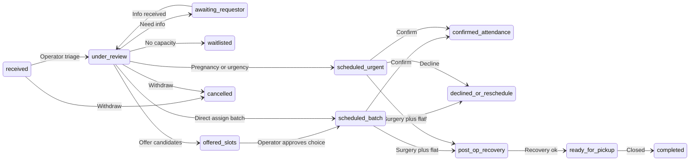

# TNR Telegram Bot — Product Requirements Document (PRD)

**Organization:** TNR programme, Tbilisi  
**Document type:** Pre-build product specification  
**Primary release:** v1 — requestor-facing bot only  
**Architecture:** Hybrid — Airtable is system of record; Telegram bot handles messaging and lightweight interactive state  

---

## 1. Problem statement, goals, non-goals, and success metrics

### 1.1 Problem statement

Requestors submit one Airtable form per cat, then rely on ad hoc messages and memory for **what stage they are in**, **what to do next**, and **when and where to arrive** on castration days. That creates anxiety, repeated questions to operators, miscommunication about fasting and carriers, and **no-shows or late arrivals** that disrupt fixed-slot batch transport to the clinic.

Operators already coordinate day, time, and clinic manually. The product should **reduce coordination load** and **improve attendance reliability** without replacing operator judgment in v1.

### 1.2 Product goals (v1)

- Give each linked requestor a **single, authoritative view of status** for their cat(s), aligned with Airtable.
- **Confirm or surface inability to attend** for assigned castration-day slots, with structured capture of responses.
- Send **timely, idempotent reminders** before castration day (and key post-op milestones where configured).
- Provide a **clear branch for urgent pregnancy routing** (non–castration-day clinic path) with different expectations and copy.
- Offer a **reliable human handoff** path (operator contact) for anything ambiguous or urgent.

### 1.3 Non-goals (v1)

- Operator or volunteer **dashboards, bulk tools, or scheduling UIs inside Telegram**.
- **Automated medical decisions** (priority beyond what operators already encode in Airtable; the bot does not diagnose).
- **Payments**, donations, or invoicing.
- **Full medical records** or clinic EMR integration.
- **Marketing broadcasts** unrelated to an active request.

### 1.4 Success metrics

| Metric                      | Definition                                                                              | Target direction |
| --------------------------- | --------------------------------------------------------------------------------------- | ---------------- |
| Link rate                   | % of new form submissions with successful Telegram ↔ record link within 24h             | Increase         |
| Pre-day confirmation rate   | % of assigned castration-day cases with explicit “attending” confirmation before cutoff | Increase         |
| No-show / late arrival rate | Arrivals missed or >15 min late vs scheduled window (if logged in Airtable)             | Decrease         |
| Operator time saved         | Self-reported minutes per case or weekly survey                                         | Increase         |
| Delivery reliability        | Failed `sendMessage` / webhook errors per 100 notifications                             | Decrease         |
| Support deflection          | Count of “where do I go?” messages to operators per case (baseline vs after)            | Decrease         |

---

## 2. Personas and scope

### 2.1 Primary persona — Requestor

- Submitted the Airtable intake form for one cat (possibly multiple forms over time for multiple cats).
- Uses Telegram; may have limited English or Georgian — **language choice** must be supported in copy and commands.
- Needs **predictability**, **logistics**, and **what to bring**, not internal priority scores.

### 2.2 Secondary personas (informed by PRD, not v1 bot users)

- **Operator:** Updates Airtable, speaks with requestors, finalizes schedule truth.
- **Transport / clinic volunteer:** Consumes lists from Airtable (out of scope for bot UI in v1).

---

## 3. Per-cat status model and transitions

### 3.1 Status enum (canonical)

Statuses are **per cat record** (one form = one cat). Names are implementation-facing; user-facing copy is localized.

| Status ID                | User-facing bucket (example)   | Meaning                                                                               |
| ------------------------ | ------------------------------ | ------------------------------------------------------------------------------------- |
| `received`               | We received your request       | Form landed; not yet triaged for scheduling.                                          |
| `under_review`           | We are reviewing your request  | Bot triaging; may need more info.                                                     |
| `waitlisted`             | You are on the waitlist        | No slot on next castration day; may be re-offered later.                              |
| `offered_slots`          | Please choose a suggested date | Bot may show buttons for candidate days (optional v1); pending operator confirmation. |
| `scheduled_batch`        | Scheduled — castration day     | Assigned to a batch castration day + window; transport batch model.                   |
| `scheduled_urgent`       | Scheduled — urgent clinic      | Pregnancy / medical urgency; **not** waiting for batch day; different clinic path.    |
| `confirmed_attendance`   | You confirmed you are coming   | Requestor confirmed via bot (or operator checked manually).                           |
| `declined_or_reschedule` | Cannot attend / rescheduling   | Requestor declined or asked reschedule; operator must act.                            |
| `day_of_checked_in`      | Checked in today               | Optional if you track arrival on the day.                                             |
| `at_clinic`              | At the clinic                  | Optional handoff state for ops.                                                       |
| `post_op_recovery`       | Recovery in our cat flat       | Post-surgery recovery phase (~1 week).                                                |
| `ready_for_pickup`       | Ready for pickup / return      | Transition out of flat.                                                               |
| `completed`              | Completed                      | Case closed from requestor perspective.                                               |
| `cancelled`              | Cancelled                      | Request withdrawn or organisation cannot serve.                                       |

**Note:** You can collapse optional ops states (`day_of_checked_in`, `at_clinic`) if they are not maintained reliably; the bot should only announce states that are **truthful and timely**.

### 3.2 Transition rules — who triggers what

| From                 | To                       | Typical trigger                                                       |
| -------------------- | ------------------------ | --------------------------------------------------------------------- |
| `received`           | `under_review`           | Operator begins triage (Airtable)                                     |
| `under_review`       | `awaiting_requestor`     | Operator flags missing info                                           |
| `awaiting_requestor` | `under_review`           | Requestor supplies info (manual operator update)                      |
| `under_review`       | `waitlisted`             | No capacity; internal priority defers this cat                        |
| `under_review`       | `offered_slots`          | Optional: automation offers 2–3 candidate days                        |
| `offered_slots`      | `scheduled_batch`        | Operator approves a chosen candidate + assigns batch day              |
| `under_review`       | `scheduled_batch`        | Operator assigns directly to castration day                           |
| `under_review`       | `scheduled_urgent`       | Pregnancy / urgency path — operator assigns alternate clinic timeline |
| `scheduled_`*        | `confirmed_attendance`   | Requestor taps Confirm OR operator sets confirmed                     |
| `scheduled_`*        | `declined_or_reschedule` | Requestor taps Cannot attend OR operator records                      |
| `scheduled_batch`    | `post_op_recovery`       | Surgery done + handoff to flat (operator)                             |
| `scheduled_urgent`   | `post_op_recovery`       | Same, if recovery still uses flat                                     |
| `post_op_recovery`   | `ready_for_pickup`       | Recovery milestone reached                                            |
| `ready_for_pickup`   | `completed`              | Cat returned / case closed                                            |
| `*`                  | `cancelled`              | Operator or policy                                                    |

### 3.3 State diagram (per cat)

---

## 4. Airtable data model and hybrid “Bot events”

### 4.1 Tables (recommended)

1. `**Cats**` (or extend your existing intake table) — one row per cat / form submission.
2. `**Requestors**` (optional normalization) — linked to many cats; stores stable contact + Telegram link. If you prefer fewer tables, keep requestor fields on `Cats` for v1.
3. `**Castration_days**` — date, max slots, meeting point text, default arrival window, notes.
4. `**Bot_events**` (recommended for hybrid state) — append-only log of structured bot actions for audit and idempotency.

### 4.2 `Cats` — minimum fields for bot + ops

| Field                                         | Type                         | Purpose                                                                           |
| --------------------------------------------- | ---------------------------- | --------------------------------------------------------------------------------- |
| `public_request_id`                           | Autonumber or formula        | Stable, non-sensitive reference shown in Telegram (“Request #…”).                 |
| `cat_name`                                    | Single line text             | Display name.                                                                     |
| `status`                                      | Single select                | Enum from §3.1.                                                                   |
| `pregnancy_risk`                              | Single select                | e.g. `none`, `early`, `late` — drives `scheduled_urgent` messaging.               |
| `language`                                    | Single select                | `ka`, `en`, `ka_en`.                                                              |
| `telegram_username_submitted`                 | Single line text             | From form (may be wrong).                                                         |
| `telegram_user_id`                            | Number or text               | Filled after successful link; **primary** key for outbound messages.              |
| `link_token`                                  | Single line text             | One-time or time-limited token for `/start`.                                      |
| `link_token_expires_at`                       | Date/time                    | Token validity.                                                                   |
| `linked_at`                                   | Date/time                    | Audit.                                                                            |
| `castration_day`                              | Link to `Castration_days`    | Batch day assignment.                                                             |
| `arrival_window_start` / `arrival_window_end` | Date/time or duration fields | Display to user.                                                                  |
| `meeting_point_summary`                       | Single line text or rollup   | Could duplicate from `Castration_days` for overrides.                             |
| `clinic_name`                                 | Single line text             | For urgent path or informational display.                                         |
| `transport_batch_id`                          | Single line text             | Internal grouping.                                                                |
| `internal_priority`                           | Number or formula            | **Not shown** to requestors by default.                                           |
| `requestor_visibility_bucket`                 | Single select                | `soon`, `this_month`, `waitlist`, `urgent_medical` — **user-facing** expectation. |
| `attendance_confirmation`                     | Single select                | `pending`, `confirmed`, `declined`, `unknown`.                                    |
| `confirmation_received_at`                    | Date/time                    | From bot or operator.                                                             |
| `surgery_completed_at`                        | Date/time                    | Triggers recovery messaging.                                                      |
| `recovery_end_expected`                       | Date                         | For pickup messaging.                                                             |
| `operator_owner`                              | Collaborator or link         | Optional routing for “human help”.                                                |
| `last_notified_status`                        | Single line text             | For idempotent notifications (or hash).                                           |
| `last_notified_at`                            | Date/time                    | Dedup / diagnostics.                                                              |
| `mute_noncritical`                            | Checkbox                     | If user invoked mute; still send mandatory messages if you define any.            |

### 4.3 `Castration_days`

| Field                  | Type                                                         |
| ---------------------- | ------------------------------------------------------------ |
| `date`                 | Date                                                         |
| `capacity_slots`       | Number                                                       |
| `slots_used`           | Number or formula / rollup                                   |
| `meeting_point`        | Long text                                                    |
| `default_instructions` | Long text (fasting, carrier — **vet-approved** template IDs) |
| `active`               | Checkbox                                                     |

### 4.4 `Bot_events` (append-only)

| Field               | Type                                                                                                      |
| ------------------- | --------------------------------------------------------------------------------------------------------- |
| `created_at`        | Created time                                                                                              |
| `cat_record_id`     | Link to `Cats`                                                                                            |
| `telegram_user_id`  | Text                                                                                                      |
| `event_type`        | Single select: `link_success`, `confirm_attend`, `decline_attend`, `choose_slot`, `command_help`, `error` |
| `payload_json`      | Long text                                                                                                 |
| `idempotency_key`   | Single line text                                                                                          |
| `processing_result` | Single select                                                                                             |

**Hybrid principle:** conversational nuance stays with operators; **machine-readable events** land in `Bot_events` and selected rollup fields on `Cats` (`attendance_confirmation`, etc.).

---

## 5. Telegram UX — commands, linking, notifications

### 5.1 Account linking flows

**Primary flow — tokenized `/start`**

1. On form submission, Airtable automation generates `link_token` + expiry, stores on cat row.
2. User receives a link: `https://t.me/<YourBot>?start=<token>` (or short code to paste: `/start LINK-AB12CD`).
3. Bot validates token, binds `telegram_user_id` to exactly one cat row (or to a **household** record if you add that later), clears or invalidates token, sends welcome message with `public_request_id` and cat name.

**Fallback — operator-initiated**

- Operator verifies Telegram username manually, then triggers automation “Send link” or resets `link_token` for the correct row.

**Edge cases (product rules)**

- **Wrong username on form:** linking still works if user has the token; operator can clear bad username field.
- **Shared device / family:** one Telegram account may link to multiple cats — show **inline list** after `/my_cats`.
- **Token reuse:** second use after success → polite message “already linked”; support path to add another cat.
- **Expired token:** instruct user to request new link from operator or self-service resend if you add it later.

### 5.2 Commands and persistent menu (v1)

| Command / action           | Behaviour                                                                                   |
| -------------------------- | ------------------------------------------------------------------------------------------- |
| `/start <token>`           | Linking flow as above.                                                                      |
| `/start` (no token)        | Short help + link to web/operator instructions.                                             |
| `/status`                  | Summarise all linked cats: status bucket, next action, castration day summary if relevant.  |
| `/cat_<public_request_id>` | Optional: drill into one cat if multiple.                                                   |
| `/help`                    | Commands, human contact, FAQ links.                                                         |
| `/language`                | Toggle or set `ka` / `en`. Writes to Airtable if authoritative.                             |
| `/stop` or `/mute`         | Sets `mute_noncritical` — **must not** block mandatory safety messages (define list in §7). |

**Inline keyboards (callbacks)**

- **Confirm** / **Cannot attend** when `status` in `{scheduled_batch, scheduled_urgent}` and `attendance_confirmation = pending`.
- **Optional:** slot choice buttons when `status = offered_slots`.

### 5.3 Notification matrix (transactional)

Events are driven by **Airtable changes** (webhook, polling, or Airtable automation hitting your backend). All sends should be **idempotent** (same state hash → no duplicate).

| Trigger (Airtable signal)               | Audience                                  | Timing                         | Message intent                                                                                |
| --------------------------------------- | ----------------------------------------- | ------------------------------ | --------------------------------------------------------------------------------------------- |
| `status` → `scheduled_batch`            | Requestor                                 | Immediate                      | Assigned date, arrival window, meeting point summary, what to bring, Confirm / Cannot attend. |
| `status` → `scheduled_urgent`           | Requestor                                 | Immediate                      | Urgency framing, clinic logistics, different expectations from batch day.                     |
| `attendance_confirmation` → `confirmed` | Requestor                                 | Immediate                      | Acknowledgement + reminder schedule.                                                          |
| `attendance_confirmation` → `declined`  | Requestor                                 | Immediate                      | Thank you + “we will contact you” + operator alert (internal).                                |
| Day before castration                   | Requestor linked to that `castration_day` | T−24h (configurable)           | Repeat window + fasting + contact if late.                                                    |
| Morning of castration                   | Same                                      | T−2h (configurable)            | Last-mile logistics.                                                                          |
| `status` → `post_op_recovery`           | Requestor                                 | Within X hours of field change | Recovery expectations, emergency line if applicable, mute rules reminder.                     |
| `status` → `ready_for_pickup`           | Requestor                                 | Immediate                      | Pickup coordination summary.                                                                  |
| `status` → `completed`                  | Requestor                                 | Immediate                      | Closure + optional one-tap feedback (phase 2).                                                |

**Quiet hours (optional product setting)**

- If local time in Tbilisi is 22:00–08:00, **defer non-urgent** notifications except `scheduled_urgent` and same-day castration reminders inside a defined “always send” window.

### 5.4 Copy and localization

- Maintain **parallel message templates** for `ka` and `en` keyed by `(status, event_type)`.
- **Medical content** (fasting, water, pre-op) must carry **vet-approved** wording; version templates in Airtable or repo with `template_version` field on `Castration_days`.

---

## 6. Scheduling, slots, priority, and waitlist behaviour

### 6.1 Authority model

- **Operators and your org rules** decide **who gets which castration day** and **internal_priority**.
- The bot **never auto-assigns** a final batch slot from priority alone in v1 unless you explicitly adopt automation later.

### 6.2 Optional “offered slots” flow (nice-to-have v1)

1. Operator sets `status = offered_slots` and links 2–3 candidate `castration_day` options (could be a linked junction table `Slot_offers`).
2. Bot sends buttons: dates only (no internal rank).
3. Requestor taps one → writes `Bot_events` + sets `pending_chosen_day` field on `Cats`.
4. Operator approves → `status = scheduled_batch`, clears pending fields, sends final confirmation.

### 6.3 Simpler v1 (recommended if time-constrained)

- Operator sets `scheduled_batch` directly with date fields populated.
- Bot only handles **Confirm / Cannot attend** and reminders.

### 6.4 Priority and what requestors see

| Internal data                 | Shown to requestor?               |
| ----------------------------- | --------------------------------- |
| `internal_priority`           | **No** (default)                  |
| `requestor_visibility_bucket` | **Yes** — coarse expectation only |
| Slot order / rank within day  | **No** (default)                  |

**Overflow / waitlist**

- When `status = waitlisted`, message template explains **you remain on the list**, **factors are capacity-based**, and **you will be contacted** when a slot opens — **no promise of exact date** unless operator sets a visibility bucket that implies timing.

**Pregnancy exception**

- If `pregnancy_risk` indicates late pregnancy, operator moves cat to `scheduled_urgent` even if a batch day exists soon. Bot copy must **never** imply the cat is on the batch car unless `status = scheduled_batch`.

---

## 7. Acceptance criteria and operational runbooks

### 7.1 Acceptance criteria by journey

**J1 — Form submission → link**

- Given a new cat row with a valid `link_token`, when the user opens `t.me/bot?start=token`, then the bot links `telegram_user_id`, sets `linked_at`, invalidates token, and sends a welcome message containing `public_request_id` and `cat_name` in the user’s `language`.

**J2 — Status mirror**

- Given a linked cat, when `status` changes in Airtable, then within **N minutes** (define SLA, e.g. 5) the user receives the template for that transition unless `last_notified_status` already equals the new composite `(status, attendance_confirmation)` hash.

**J3 — Confirm attendance**

- Given `status ∈ {scheduled_batch, scheduled_urgent}` and `attendance_confirmation = pending`, when the user taps **Confirm**, then Airtable updates to `confirmed`, `confirmation_received_at` is set, a `Bot_events` row is written with unique idempotency key, and the user receives acknowledgement.

**J4 — Cannot attend**

- Given the same preconditions, when the user taps **Cannot attend**, then Airtable updates to `declined`, operator notification channel receives an alert (email/Slack/Telegram internal — implementation choice), and the user receives a calm confirmation message.

**J5 — Reminders**

- Given `confirmed` attendance for a `castration_day = D`, when wall-clock hits `D − 24h` in org timezone, then the reminder is sent once per cat per event type (dedup key includes `cat_id` + `reminder_24h`).

**J6 — Urgent path**

- Given `status = scheduled_urgent`, when any reminder fires, then copy **must not** reference batch meeting point unless `meeting_point_summary` explicitly tagged for urgent clinic.

**J7 — Multi-cat**

- Given one `telegram_user_id` linked to multiple open cats, when the user sends `/status`, then the bot returns a numbered list with distinct `public_request_id` lines and next action for each.

**J8 — Mute**

- Given `mute_noncritical = true`, when a non-critical template would fire, then it is suppressed; when a **mandatory** template fires (same-day logistics, urgent path assignment, cancellation), it is still delivered.

### 7.2 Operational runbooks

**R1 — Telegram delivery failures**

- Monitor failed sends; if user blocked bot, set a `delivery_blocked` flag on cat via webhook error and surface to operator in Airtable view “Contact via phone”.

**R2 — Duplicate callbacks**

- Telegram may retry; `Bot_events.idempotency_key` UNIQUE → second insert ignored; user still receives “already recorded” if needed.

**R3 — Airtable API outage**

- Queue outbound notifications; backoff; after max age, alert ops and optionally mark `notification_backlog` on row.

**R4 — Wrong person linked**

- Operator runs “Reset link” → clears `telegram_user_id`, issues new `link_token`, audit note.

**R5 — Staging / dry-run**

- Separate Airtable base or prefix `public_request_id` with `TEST-`; bot uses environment flag to restrict sends to allowlisted chat IDs.

### 7.3 Human handoff

- Every critical screen includes **“Contact us”** with a **single tap** (`tg://user?id=...` or `https://t.me/operator_handle`) or phone link, per org policy.
- Operators maintain a short **FAQ** page linked from `/help`.

---

## 8. Security and privacy appendix

### 8.1 Data minimization in chat

- Prefer **public_request_id** over full name + address in the same message where feasible; never post **full residential address** unless operationally necessary and consent-covered — prefer meeting point for batch days.

### 8.2 Retention

- Define retention for `telegram_user_id` and `Bot_events` after `completed` (e.g. 12–24 months for impact reporting, or delete on request).

### 8.3 Access control

- Airtable personal access token or OAuth app with **least privilege** scopes.
- Secrets in environment variables; rotate on volunteer offboarding.

### 8.4 Mandatory vs mutable messages

- **Mandatory (example):** same-day castration window changes, cancellation, urgent reassignment.
- **Mutable / respect mute:** general education, non-urgent tips.

### 8.5 Abuse and safety

- Rate-limit `/start` attempts per chat.
- Log suspicious token brute-force (many failures from one `telegram_user_id`).

---

## 9. Phased roadmap

| Phase                     | Scope                                                                                                                        |
| ------------------------- | ---------------------------------------------------------------------------------------------------------------------------- |
| **Phase 0 — Spec freeze** | Lock enums, fields, message templates with vet sign-off for medical lines.                                                   |
| **Phase 1 — MVP**         | Linking, `/status`, status-driven notifications, confirm/decline, reminders, urgent branch copy, operator alerts on decline. |
| **Phase 1.5**             | Offered-slots flow + `Slot_offers` table if needed.                                                                          |
| **Phase 2**               | Multi-language polish, pickup scheduling UI, satisfaction survey, analytics dashboard.                                       |
| **Phase 3**               | Optional operator Telegram tools **only if** demand proven.                                                                  |

---

## 10. Open decisions checklist (workshop)

- Final Georgian copy deck + tone guidelines  
- Exact fasting rules per clinic / vet letter  
- Whether `scheduled_urgent` cats always use flat recovery or sometimes direct return home  
- SLA for “Airtable change → Telegram delivery”  
- Operator alert channel for declines  
- Legal basis and consent text on the intake form for Telegram messaging

---

*End of PRD — ready for engineering spike (Airtable automation + bot framework choice) after sign-off.*